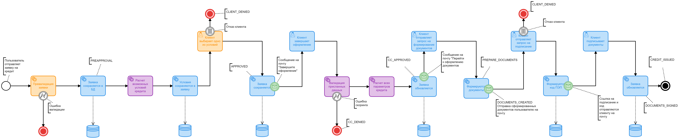
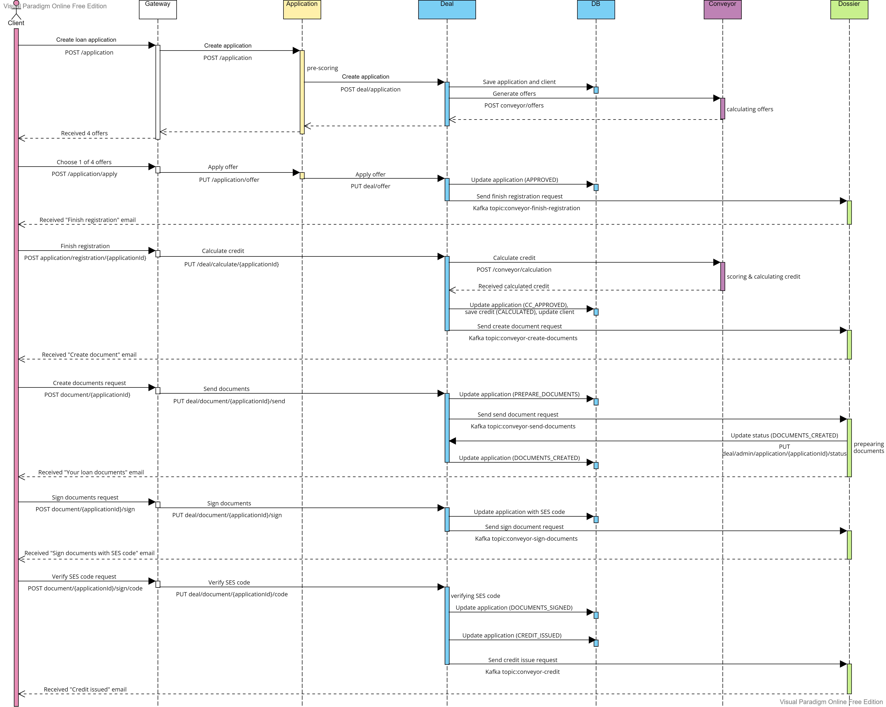
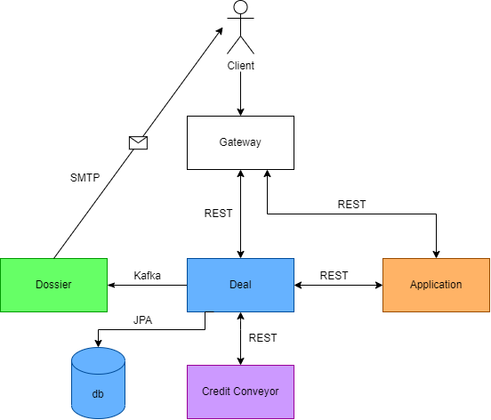
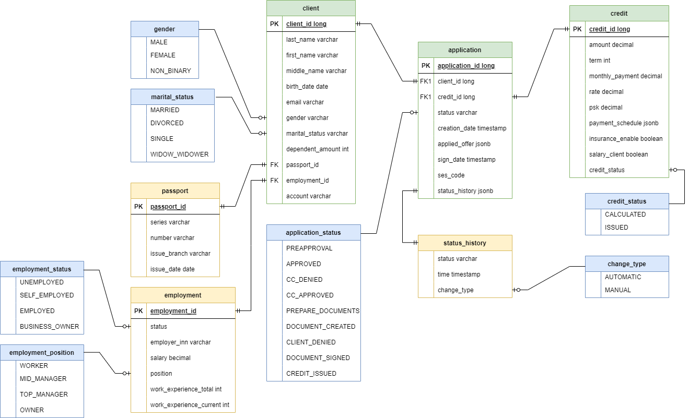

# Credit conveyor
 Приложение для расчета, обработки и сохранения кредита.
## Используемые технологии
1. Spring boot (включающий JPA, Lombok, Feign client, Email message sender)
2. PostgreSQL
3. Swagger
3. Liquibase
4. Docker
5. Kafka
6. GitHub actions
## Принцип работы
1. Пользователь отправляет заявку на кредит.
2. МС Заявка осуществляет прескоринг заявки и если прескоринг проходит, то заявка сохраняется в МС Сделка и отправляется в кредитный конвейер (КК).
3. КК возвращает через МС Заявку пользователю 4 предложения (сущность "LoanOffer") по кредиту с разными условиями (например без страховки, со страховкой, с зарплатным клиентом, со страховкой и зарплатным клиентом) или отказ.
4. Пользователь выбирает одно из предложений, отправляется запрос в МС Заявка, а оттуда в МС Сделка, где заявка на кредит и сам кредит сохраняются в базу.
5. МС Сделка отправляет клиенту письмо с текстом "Ваша заявка предварительно одобрена, завершите оформление".
6. Клиент отправляет запрос в МС Сделка со всеми своими полными данными о работодателе и прописке. Происходит скоринг данных в КК, КК рассчитывает все данные по кредиту (ПСК, график платежей и тд), МС Сделка сохраняет обновленную заявку и сущность кредит сделанную на основе CreditDTO полученного из КК со статусом CALCULATED в БД.
7. После валидации МС Сделка отправляет письмо на почту клиенту с одобрением или отказом. Если кредит одобрен, то в письме присутствует ссылка на запрос "Сформировать документы"
8. Клиент отправляет запрос на формирование документов в МС Сделка, МС Сделка отправляет клиенту на почту документы для подписания и ссылку на запрос на согласие с условиями.
9. Клиент может отказаться от условий или согласиться. Если согласился - МС Сделка на почту отправляет код и ссылку на подписание документов, куда клиент должен отправить полученный код в МС Сделка.
10. Если полученный код совпадает с отправленным, МС Сделка выдает кредит (меняет статус сущности "Кредит" на ISSUED, а статус заявки на CREDIT_ISSUED)
### Схема выполнения бизнес-логики

#### **Цвета**:

*Оранжевый: МС Заявка*

*Голубой: МС Сделка + БД*

*Фиолетовый: МС Кредитный Конвейер*

*Зеленый: МС Кредитное Досье*

*Красный: конец флоу*

#### **Типы действий**:

*Иконка "человек" сверху слева: пользовательское действие*

*Иконка "зубчатое колесо" сверху слева: действие системы*

*Иконка "молния": ошибка*

*Иконка "прямоугольник с горизонтальными полосками": выбор пользователя*

*Иконка "конверт": асинхронная отправка email-сообщения на почту*

### Sequence-диаграмма

### Архитектура проекта
Архитектура проекта представляет собой 5 микросервисов обработки данных и одну базу данных.
#### Микросервисы
1. Gateway
2. Deal
3. Application
4. Conveyor
5. Dossier

#### База данных

